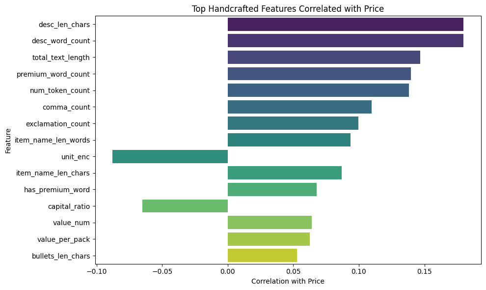

# Amazon ML Challenge: Multimodal Product Price Prediction

[](https://www.python.org/)
[](https://scikit-learn.org/)
[](https://pytorch.org/)

Predicting e-commerce product prices using **multimodal machine learning** that combines textual metadata and visual features extracted from product images.

---

## 🎯 Project Overview

### Problem Statement
Given product metadata (name, description, brand, specifications) and product images, predict the item price using a multimodal ML pipeline.

### Key Challenges
- **Unstructured text** with inconsistent formatting
- **Missing values** across multiple fields (30-40% in some columns)
- **Variable image quality** (different resolutions, lighting, backgrounds)
- **High-dimensional feature space** requiring careful engineering

---

## 📊 Results

| Approach | SMAPE Score | Improvement |
|----------|-------------|-------------|
| **Text Features Only** (TF-IDF baseline) | 0.56 | Baseline |
| **Text + Image Features** (Multimodal) | **0.49** | **13% improvement** |

---

## 🏗️ Feature Engineering Pipeline

### 1. Text Features

**Extracted Features (50+ dimensions):**
- Character and word counts
- Token statistics and bullet point analysis
- Numerical value extraction (min, max, mean, sum)
- Capital letter ratio and punctuation density
- Premium keyword indicators
- **TF-IDF embeddings** (2000 dimensions)

### 2. Image Features

**Extracted Features (2050+ dimensions):**
- Image width, height, and file size
- Dominant colors using KMeans clustering
- Color richness (pixel variance)
- **ResNet50 deep embeddings** (2048-d vector)

**Design Choice:** ResNet50 used only as feature extractor (not fine-tuned) to keep computation scalable.

### 3. Multimodal Fusion

Text and image features are processed independently and merged using `sample_id` before feeding into LightGBM regressor.

---

## 📁 Project Structure

```
amazon-ml-challenge/
│
├── assets/
│   ├── hand_craft_feature_corr.jpg          # Handcrafted feature correlation
│   └── TF_IDF_feature_corr.jpg              # TF-IDF feature correlation
│
├── notebook/
│   └── [main notebook]              # Feature engineering + model training
│
│
└── README.md
```

**Note:** Processed CSV files not included in repo due to GitHub size limits. The notebook can regenerate features from raw data.

---

## 🔧 Technical Stack

- **Data Processing:** Pandas, NumPy
- **Text Features:** scikit-learn (TF-IDF)
- **Image Features:** PyTorch, ResNet50, OpenCV, PIL
- **Modeling:** LightGBM
- **Visualization:** Matplotlib, Seaborn

---

## 📈 Feature Correlation Analysis

<p align="center">
  
  
</p>

**Key Observations:**
- **Text features:** Numerical extractions and premium keywords show strong correlation with price
- **Image features:** Color richness and ResNet embeddings capture product category patterns
- **TF-IDF sparsity:** ~96% (expected for large vocabulary)
